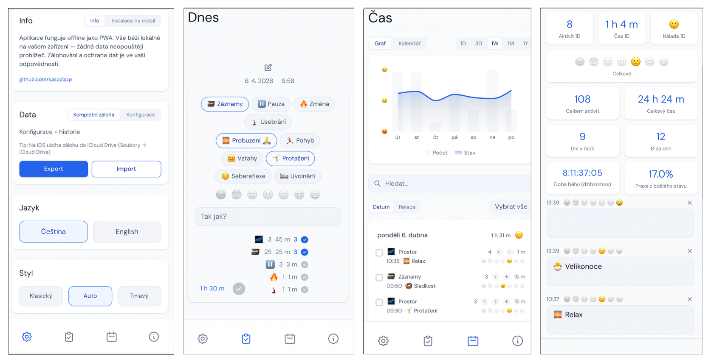

<p align="center">
  
</p>

<h1 align="center">PRA</h1>

<p align="center">Vědomý prostor pro každodenní praxi.</p>

Česky | **[English](README.md)**

**[Spustit aplikaci](https://kasaj.github.io/app/)**

<p align="center">
  
</p>

## O aplikaci

PRA je aplikace pro vědomou praxi postavená na jednoduché myšlence: kvalita života se odvíjí od bdělosti — jak jemně vnímáme skutečnost i sebe sama a jak vědomě jednáme.

Řídí se přirozenou mechanikou změny: **myšlenka → slovo → čin → zvyk → charakter → osud.**

Aplikace neučí. Poskytuje strukturu pro každodenní praxi a tichý prostor pro zastavení, reflexi a návrat k sobě. Vše běží lokálně na vašem zařízení — žádné účty, servery ani sledování.

## Filozofie

Aplikace je organizována kolem tří otázek:

- **Proč** — bez zakořenění ve smyslu žádná praxe nevydrží. Proč je kořen, ze kterého vše ostatní vyrůstá.
- **Jak** — disciplína je forma lásky k tomu, čím se chceme stát. Most mezi záměrem a skutečností.
- **Co** — metoda a konkrétní praxe. Obsah bez směru je hluk, metoda bez formy chaos.

Každý uživatel si může zapsat vlastní odpovědi na tyto otázky přímo v aplikaci (stránka Info).

## Aktivity

PRA obsahuje výchozí sadu aktivit, které lze libovolně upravit nebo doplnit vlastními:

| Aktivita | Typ | Popis |
|----------|-----|-------|
| 🌌 **Prostor** | Základní (core) | Základ stránky Dnes — hodnocení nálady hvězdičkami, vlastnosti (properties) a komentář |
| 🗃️ **Záznamy** | Okamžik | Rychlý záznam poznámky nebo záměru |
| ⏸️ **Pauza** | Časová (2 min) | Vědomé zastavení, dech, přítomnost |
| 🔥 **Změna** | Okamžik | Vědomý krok ke změně — čelení zlozvyku, nový návyk, malý odvážný čin |
| 🧎 **Usebrání** | Okamžik | Krátká sebereflexe, ztišení, návrat k sobě |

Všechny aktivity jsou plně přizpůsobitelné — název, emoji, popis, délka trvání a vlastnosti. Změny se ukládají automaticky. Aktivity lze přidávat a mazat přímo ze stránky Dnes (režim úprav).

## Funkce

- **Stránka Dnes** — centrální obrazovka: bubliny aktivit, vlastnosti (properties), hodnocení hvězdičkami, komentář, přehled relace a záznamů
- **Vlastnosti (properties)** — klikatelné štítky pro kontext záznamu (stav, téma, situace). Použité v relaci mají accent rámeček, aktuálně vybrané jsou vyplněné
- **Relace** — čas strávený praxí od posledního resetování; resetování spustí novou relaci. Záznamy aktivit jsou seřazeny dle celkové doby
- **Časové aktivity** — odpočítávání s plánovaným časem ukončení, gong, pauza/pokračování, předčasné dokončení
- **Okamžikové aktivity** — okamžitý záznam bez časovače
- **Hodnocení stavu** — hvězdičková škála 1–5 s volitelným komentářem; vše propojeno s časovou značkou
- **Škála nálady** — přizpůsobitelná emoji škála pro sledování emočního stavu
- **Propojování aktivit** — automatické propojení záznamů v rámci relace, navigace šipkami
- **Stránka Čas** — chronologický přehled záznamů, denní/týdenní/měsíční trend nálady, kalendář s barevným kódováním, statistiky
- **Stránka Info** — filozofický kontext (Proč/Jak/Co) s osobními poznámkami a citáty
- **Nastavení** — správa aktivit, jazyk (čeština/angličtina), téma (Auto/Klasické/Tmavé), záloha a import
- **Konfigurace** — oddělené JSON soubory pro češtinu (`default-config-cs.json`) a angličtinu (`default-config-en.json`). Export konfigurace je vždy v aktuálním jazyce
- **Záloha** — kompletní export dat (záznamy + konfigurace) ve formátu JSON, import vždy merguje
- **Chytrá synchronizace** — detekuje změny konfigurace, přidá nové aktivity a zachová uživatelské úpravy
- **Dvojjazyčné** — čeština a angličtina s oddělenými vlastnostmi a poznámkami dle jazyka
- **Offline / PWA** — funguje bez internetu, instalovatelná na plochu telefonu
- **CI/CD** — push na main automaticky nasadí přes GitHub Actions

## Příklad použití: Sledování zlozvyků a jejich nahrazování

> **Záměr:** Systematicky zaznamenávat momenty, kdy dochází k zlozvyku nebo impulzu, vědomě je pojmenovávat a sledovat, jak se vzorec v čase mění.

**Nastavení (jednorázové):**

1. V Nastavení → Aktivity přidej aktivity odpovídající situacím, které chceš sledovat — např.:
   - `📱 Obrazovka` — sáhl jsem po telefonu bez záměru
   - `🍬 Impulz` — přišla chuť nebo nutkání
   - `🔁 Náhrada` — zlozvyk jsem vědomě nahradil jinou akcí
2. Jako vlastnosti (properties) nastav kontexty: `Stres`, `Nuda`, `Únava`, `Automatismus`
3. Délku trvání core aktivity (Prostor) nastav dle potřeby — třeba 1–2 min

**Každodenní praxe:**

- Ráno: ohodnoť náladu hvězdičkami a zapiš záměr dne jako komentář
- Během dne: při každém výskytu situace — otevřeš aplikaci, klepneš na aktivitu, vybereš property (co to spustilo) a uložíš
- Opakovaný výskyt v rámci relace se automaticky propojí a zobrazí jako série
- Večer nebo kdykoliv: na stránce Čas prohlédni vzorce — kdy, za jakých podmínek, jak často

**Co aplikace ukáže:**

- Frekvenci jednotlivých situací v čase (stránka Čas, kalendář)
- Korelaci mezi náladou a výskytem (hodnocení hvězdičkami)
- Vývoj poměru „zlozvyk vs. náhrada" session po session
- Celkový čas strávený vědomou praxí

Aplikace nehodnotí ani neupomíná. Je to tiché zrcadlo — záznamy mluví samy.

## Instalace na mobil

1. Otevřete [aplikaci](https://kasaj.github.io/app/) v prohlížeči
2. **iOS Safari**: Sdílet → Přidat na plochu
3. **Android Chrome**: Menu → Přidat na plochu

Funguje offline. Všechna data zůstávají na vašem zařízení.

## Konfigurace

Aplikaci řídí oddělené soubory `public/default-config-cs.json` a `public/default-config-en.json`. Formát je plochý (flat) — jeden jazyk na soubor:

```json
{
  "version": 1,
  "name": "default",
  "language": "cs",
  "theme": "modern",
  "activities": [
    {
      "type": "pauza",
      "emoji": "⏸️",
      "durationMinutes": 2,
      "name": "Pauza",
      "description": "Vědomé zastavení",
      "properties": ["Dech", "Ticho"]
    }
  ],
  "moodScale": [
    { "value": 1, "emoji": "😡", "labelCs": "Vztek" }
  ],
  "info": {
    "cs": { "intro": "...", "why": "...", "how": "...", "what": "..." }
  }
}
```

Úprava configu → push na main → automatické nasazení. Nové aktivity se uživatelům přidají automaticky. Uživatelem upravené aktivity se nikdy nepřepisují.

## Soukromí

- Všechna data zůstávají na vašem zařízení (localStorage)
- Žádná analytika, sledování ani cookies
- Žádný server — čistě klientská aplikace
- Zálohování je ve vaší odpovědnosti

## Technologie

React + TypeScript, Vite, Tailwind CSS, Recharts, PWA, GitHub Actions, GitHub Pages

## Vývoj

```bash
npm install        # Instalace závislostí
npm run dev        # Vývojový server (localhost:3000)
npm run build      # Build pro produkci
```

Push na `main` automaticky nasadí přes GitHub Actions.

## Licence

MIT
